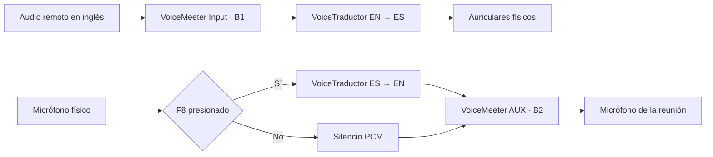

<p align="center">
  
</p>

<h1 align="center">VoiceTraductor</h1>

<p align="center">
  <strong>Interpretación bidireccional inglés ↔ español para reuniones virtuales en Windows.</strong>
  <br>
  Voz traducida, subtítulos en vivo, Push-to-Talk e historial local cifrado.
</p>

<p align="center">
  <a href="https://github.com/IAZARA/Proyecto_Voice_Traduccion/actions/workflows/windows.yml">
    
  </a>
  
  
  
  
</p>

## Descripción

VoiceTraductor es una aplicación de escritorio personal que convierte una reunión bilingüe en una conversación más natural:

- La otra persona habla en **inglés** y tú escuchas una voz sintética en **español**.
- Tú hablas en **español** y la reunión recibe una voz sintética en **inglés** mientras mantienes presionado `F8`.
- Ambas direcciones muestran texto original y traducción con marcas de tiempo.
- El overlay permanece visible sobre Zoom, Google Meet, Teams u otra plataforma compatible.

La aplicación usa dos sesiones independientes del endpoint
[`/v1/realtime/translations`](https://developers.openai.com/api/docs/guides/realtime-translation)
con `gpt-realtime-translate`. El audio se procesa como PCM16 mono a 24 kHz en bloques de 200 ms.

> [!IMPORTANT]
> VoiceTraductor requiere una API key propia de OpenAI. El uso de la Realtime API puede generar costos según la duración de la reunión.

## Características

| Área | Implementación |
| --- | --- |
| Traducción entrante | Inglés remoto → audio y subtítulos en español |
| Traducción saliente | Español local → inglés únicamente con Push-to-Talk |
| Audio | WASAPI + NAudio, remuestreo a PCM16 mono/24 kHz |
| Control | Botón PTT y hotkey global configurable; `F8` por defecto |
| Subtítulos | Overlay movible, texto original y traducción incremental |
| Resiliencia | Búfer adaptativo, backpressure y reconexión 0,5/1/2/4 s |
| Historial | SQLite local con consulta, eliminación y recuperación parcial |
| Exportación | TXT bilingüe y WebVTT con marcas de tiempo |
| Seguridad | API key y subtítulos cifrados con DPAPI para el usuario actual |
| Privacidad | No crea archivos de audio ni envía contenido a telemetría |

## Flujo de audio



Se recomienda usar auriculares para impedir que el audio traducido vuelva a entrar al micrófono.

## Requisitos

- Windows 11 x64.
- Una API key de OpenAI con acceso a Realtime API.
- [VoiceMeeter Banana](https://vb-audio.com/Voicemeeter/banana.htm) instalado desde su fuente oficial.
- Auriculares y micrófono físico.
- Para desarrollo: SDK de [.NET 10](https://dotnet.microsoft.com/download/dotnet/10.0).

El paquete publicado es autocontenido y no requiere instalar .NET en el equipo de uso.

## Configuración rápida

### 1. Configura VoiceMeeter

1. En la tira **VoiceMeeter VAIO**, activa solamente **B1**.
2. En Zoom, Meet o Teams selecciona `VoiceMeeter Input` como altavoz.
3. En la tira **VoiceMeeter AUX**, activa solamente **B2**.
4. En la plataforma de reunión selecciona `VoiceMeeter Aux Output` como micrófono.

### 2. Configura VoiceTraductor

En el asistente inicial selecciona:

| Campo | Dispositivo |
| --- | --- |
| Audio de reunión | `VoiceMeeter Output` (B1) |
| Micrófono local | Tu micrófono físico |
| Reproducción | Tus auriculares físicos |
| Salida a la reunión | `VoiceMeeter Aux Input` |

Después introduce y valida tu API key, ejecuta las pruebas de tono y nivel, y comienza la reunión.

### 3. Habla con Push-to-Talk

- Mantén `F8` mientras hablas en español.
- Suelta `F8` para cortar inmediatamente la captura real.
- El audio inglés original comienza silenciado y puede mezclarse con su deslizador.
- El monitoreo de tu propia voz inglesa permanece desactivado por defecto.

## Compilar y ejecutar

```powershell
git clone https://github.com/IAZARA/Proyecto_Voice_Traduccion.git
cd Proyecto_Voice_Traduccion
dotnet restore VoiceTraductor.sln
dotnet build VoiceTraductor.sln --configuration Release
dotnet run --project src/VoiceTraductor.App/VoiceTraductor.App.csproj
```

Para ejecutar las pruebas:

```powershell
dotnet test VoiceTraductor.sln --configuration Release
```

Para generar el ejecutable autocontenido `win-x64`:

```powershell
.\scripts\publish.ps1
```

El resultado se escribe en `artifacts\publish\win-x64`.

## Arquitectura

```text
src/
├── VoiceTraductor.App             WPF, MVVM, overlay y hotkey global
├── VoiceTraductor.Core            contratos, modelos y lógica de subtítulos
└── VoiceTraductor.Infrastructure  Realtime API, WASAPI, SQLite y DPAPI

tests/
└── VoiceTraductor.Tests           pruebas unitarias y de integración
```

Los contratos principales son `ITranslationStream`, `IAudioEndpointService`,
`ICaptionAssembler`, `ITranscriptStore` e `ICredentialStore`. El modelo y el endpoint
Realtime están encapsulados en infraestructura para poder actualizarlos sin reescribir el pipeline.

## Datos y privacidad

| Dato | Ubicación | Protección |
| --- | --- | --- |
| API key | `%LOCALAPPDATA%\VoiceTraductor\credential.bin` | DPAPI, usuario actual |
| Reuniones | `%LOCALAPPDATA%\VoiceTraductor\meetings.db` | Textos cifrados |
| Audio | No se almacena | Procesamiento en memoria |
| Exportaciones | Ubicación elegida por el usuario | TXT/VTT sin cifrar |

Las reuniones permanecen en el historial hasta que el usuario las elimina. Los logs no contienen claves ni contenido de la reunión.

## Validación

La solución incluye pruebas para:

- bloques PCM exactos de 9.600 bytes por 200 ms;
- ensamblado y segmentación de subtítulos;
- aislamiento y liberación inmediata de PTT;
- configuración y eventos del protocolo Realtime;
- persistencia cifrada y exportaciones TXT/WebVTT;
- rutas de audio sin cruce entre entrada y salida.

El objetivo de latencia es comenzar audio y subtítulos traducidos en menos de 2,5 segundos para al menos el 95 % de las frases sobre una conexión estable. Es un objetivo de aceptación, no una garantía de la red o del proveedor.

## Limitaciones del MVP

- Solo inglés ↔ español.
- Windows 11 x64 y una única mezcla de participantes remotos.
- Voz sintética; no realiza clonación de voz.
- No identifica hablantes individuales.
- VoiceMeeter debe instalarse y configurarse manualmente.
- Sin backend, cuentas, pagos, traducción local ni actualizaciones automáticas.

## Tecnologías

- C# 14, .NET 10 y WPF
- OpenAI Realtime Translation API
- NAudio y WASAPI
- SQLite
- Windows DPAPI
- xUnit

---

<p align="center">
  Diseñado para que el idioma deje de ser una interrupción en la conversación.
</p>
